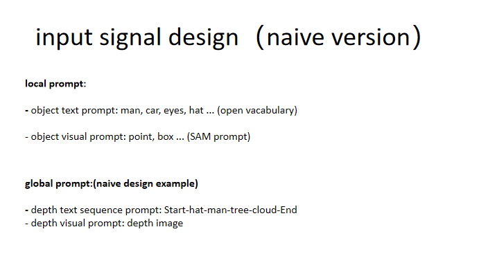
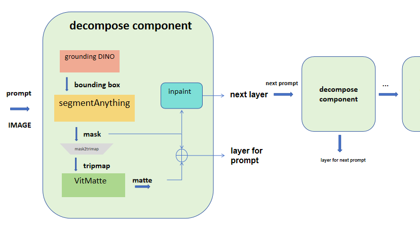
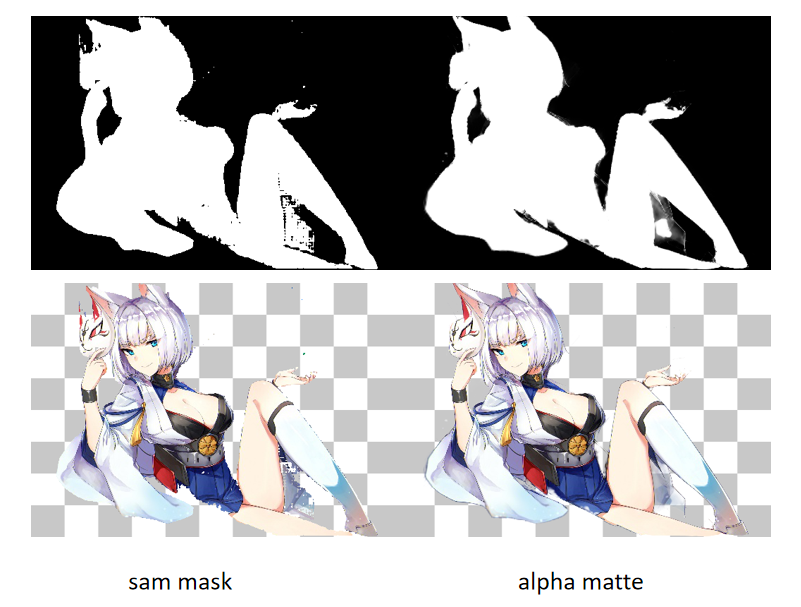
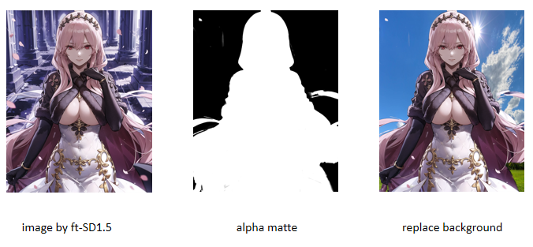

<div align="center">
<h1>decompose-anything</h1>
<h3> use SAM and some new tech cooperating with Inpaint to decompose layers wisely.  </h3>

Authors: Wt.Y

Institute: ZJU

(<sup>:email:</sup>) corresponding author


</div>


#

## News

* **`2023/08/15`** Create repo


#

## Introduction


## Features
* Inpaint wisely with Layer Knowledge and User design
* Layer perception
* Decompose Anything with Simple Interaction
* High Quality Matting and Mask Results

  

## Quick Start


### Quick Installation

Install [Segment Anything Models](https://github.com/facebookresearch/segment-anything) as following:

```
pip install git+https://github.com/facebookresearch/segment-anything.git
```

Install [ViTMatte](https://github.com/hustvl/ViTMatte) as following:
```
python -m pip install 'git+https://github.com/facebookresearch/detectron2.git'
pip install -r requirements.txt
```

Install [GroundingDINO](https://github.com/IDEA-Research/GroundingDINO) as following:
```
cd Matte-Anything
git clone https://github.com/IDEA-Research/GroundingDINO.git
cd GroundingDINO
pip install -e .
```

Download pretrained models [SAM_vit_h](https://dl.fbaipublicfiles.com/segment_anything/sam_vit_h_4b8939.pth), [ViTMatte_vit_b](https://drive.google.com/file/d/1d97oKuITCeWgai2Tf3iNilt6rMSSYzkW/view?usp=sharing), and [GroundingDINO-T](https://github.com/IDEA-Research/GroundingDINO/releases/download/v0.1.0-alpha/groundingdino_swint_ogc.pth). Put them in ``./pretrained``

### Run our web-ui!


### How to use
1. Upload the image and click on it (default: ``foreground point``).
2. Click ``Start!``.
3. Modify ``erode_kernel_size`` and ``dilate_kernel_size`` for a better trimap (optional).


## 📋 Todo List
- [] Matte part
- [] Inpaint part
- [] layer perception part
## Input Signal

## Decompose component

## Matte part
we find a good matte repo Matte-Anything which part similar as our matte thinking.And we use their repo to do some matte work.



## Acknowledgement

- [Segment Anything](https://github.com/facebookresearch/segment-anything)
- [GroundingDINO](https://github.com/IDEA-Research/GroundingDINO)
- 
- [stable-diffusion-webui](https://github.com/AUTOMATIC1111/stable-diffusion-webui)
- 
- [matte_Anything](https://github.com/hustvl/Matte-Anything)
- [ViTMatte](https://github.com/hustvl/ViTMatte)

Thanks to their work we can easilier get good output.
## Citation
```
@article{decompose_anything,
  year={2023}
}
```
